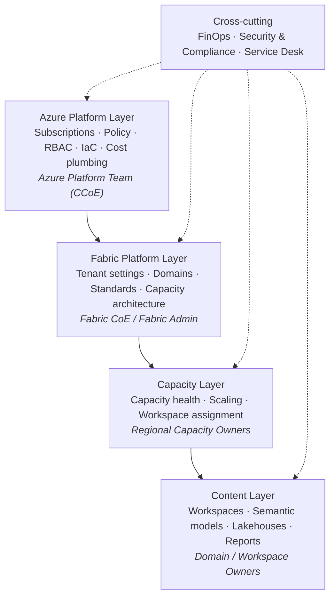

# Operating Model Guidance: Power BI Premium to Microsoft Fabric Capacity

> **Context:** Large retail / grocery enterprise, 15+ capacities across 3 Azure regions, multiple teams responsible for Power BI, moving from Power BI Premium (P SKU) to Fabric Capacity (F SKU).

| Document property | Value |
|---|---|
| Title | Operating Model Guidance: Power BI Premium to Microsoft Fabric Capacity |
| Version | 1.0 |
| Status | Draft for review |
| Date | 2026-10-04 |
| Validity | Reflects Microsoft Fabric behaviour as of October 2026. Fabric changes monthly, so validate details against Microsoft Learn before relying on them |
| Full change history | See [Version Log](#version-log) |

---

## Overview

1. [Executive Summary](#executive-summary)
2. [What Changes from P SKU to F SKU](#what-changes)
3. [Responsibility Layers](#responsibility-layers)
4. [Operating Model Building Blocks](#building-blocks)
   - 4.1 [Azure Landing Zone for Fabric](#landing-zone)
   - 4.2 [Capacity Strategy and Topology](#capacity-strategy)
   - 4.3 [Capacity Lifecycle Processes](#capacity-lifecycle)
   - 4.4 [Tenant, Domain and Workspace Governance](#tenant-governance)
   - 4.5 [Monitoring and Incident Management](#monitoring)
   - 4.6 [FinOps and Chargeback](#finops)
   - 4.7 [Security, Compliance and BCDR](#security)
   - 4.8 [Licensing Considerations](#licensing)
5. [Roles and Responsibilities](#roles)
   - 5.1 [CoE Structure](#coe-structure)
6. [RACI Matrix](#raci)
7. [Transition Approach](#transition)
8. [Key Decisions](#key-decisions)
9. [Things to Consider](#considerations)
   - 9.1 [Glossary](#glossary)
   - 9.2 [Assumptions and Open Questions](#assumptions)
10. [References](#references)
11. [Version Log](#version-log)

---

## 1. Executive Summary

Power BI Premium per capacity (P SKUs) is being retired. Existing P capacities run until the end of their current term, so the P contract end dates are the hard deadline for this move. Moving from Power BI Premium to Fabric Capacity is more than a licence change. An F SKU is an **Azure resource** (`Microsoft.Fabric/capacities`) that lives in an Azure subscription, is billed through Azure and is controlled by Azure RBAC. At the same time, the **content and settings** of the capacity are still managed in the Fabric admin portal.

This means capacity management becomes a **shared responsibility** between:

- the **Azure Platform Team**, which owns the resource, subscription, policies and cost plumbing, and
- the **Power BI / Fabric team(s)**, which own the platform configuration, workloads, workspaces and content.

The goal of the operating model is to make this split explicit, so that it is clear who **decides**, who **executes** and who **pays**. That has to work across 15+ capacities, 3 regions and several BI teams, and it has to hold up during retail peak seasons.

[Back to top](#top)

---

## 2. What Changes from P SKU to F SKU

| Area | Power BI Premium (P SKU) | Fabric Capacity (F SKU) |
|---|---|---|
| Purchase and billing | M365 licensing via the admin center | Azure resource in a subscription/resource group. Billed through Azure and MACC-eligible |
| Who can create or scale it | M365 / billing admins | Create: anyone with Azure RBAC (Owner/Contributor) on the subscription or resource group. Scale, pause and resume: the Azure RBAC actions on the capacity resource **and** the Fabric capacity admin role, so both control planes are involved |
| Cost models | Monthly or yearly billing with a monthly commitment, bought as an M365 subscription | Pay-as-you-go (pause, resume, scale) or a Fabric capacity reservation (1 or 3 years), or a mix |
| Admin planes | Fabric / Power BI admin portal only | **Two control planes:** Azure (resource, SKU, region, tags, cost, RBAC) and the Fabric admin portal (capacity admins, contributors, settings, workspaces, delegated tenant settings) |
| Workloads | Mainly Power BI | Power BI plus Spark, Data Warehouse, Real-Time Intelligence and Data Factory, all competing for the same Capacity Units (CUs) |
| Governance tooling | Admin portal | Adds Azure Policy, tags, Cost Management budgets, CU quotas, Activity Log, PIM and Infrastructure-as-Code |

**SKU mapping:** P1 = F64, P2 = F128, P3 = F256, P4 = F512, P5 = F1024. The mapping compares compute, not licensing terms. F2 to F32 have no P equivalent and suit Dev/Test or small teams.

> **Key insight:** whoever controls the Azure resource controls cost, size and region. Whoever is a capacity admin in Fabric controls what runs on it. The operating model has to design this split on purpose.

[Back to top](#top)

---

## 3. Responsibility Layers

| Layer | Primary question it answers | Owner |
|---|---|---|
| Azure Platform | *Where and how can capacities exist?* | Azure Platform Team |
| Fabric Platform | *What is allowed on the platform and how is it structured?* | Fabric CoE |
| Capacity | *Is this capacity healthy, correctly sized and used by the right workspaces?* | Regional Capacity Owner |
| Content | *Is the content well-built, efficient and secure?* | Domain / Workspace Owner |
| Cross-cutting | *Is it affordable, compliant and supported?* | FinOps, Security, Service Desk |

[Back to top](#top)

---

## 4. Operating Model Building Blocks

### 4.1 Azure Landing Zone for Fabric

This is a one-off setup, owned by the Azure Platform Team.

- **Subscription design:** align with the organisation's own Azure landing zone strategy and with how cost and ownership are organised internally, for example by environment (Prod and Non-Prod) or by business unit. A common pattern is dedicated Fabric subscription(s) with resource groups per region or business unit. Whatever the pattern, avoid scattering capacities across application subscriptions.
- **Naming convention:** the Azure resource name allows lowercase letters and digits only (no hyphens), must start with a letter and be 3 to 63 characters, for example `fc<region><bu><env><nn>` (such as `fcweusupplychainprd01`). A Fabric capacity cannot be renamed, so a name change means a new capacity and a workspace move. Get the convention right before the first deployment.
- **Mandatory tags:** `CostCenter`, `BusinessOwner`, `CapacityOwner`, `Environment`, `DataClassification`, `Archetype`.
- **Azure Policy:**
  - Allow `Microsoft.Fabric/capacities` only in approved subscriptions.
  - Allow only the 3 approved regions.
  - Enforce the mandatory tags.
  - Optionally restrict the allowed SKUs.
  - Deny capacity creation everywhere else, to prevent "shadow capacities".
- **RBAC:**
  - Keep Owners/Contributors to a minimum and manage them through **Privileged Identity Management (PIM)**.
  - Grant *Reader* to the Fabric CoE and FinOps.
  - Put a *CanNotDelete* lock on production capacities. Do not use a *ReadOnly* lock, it blocks scaling, pause and resume.
- **Infrastructure-as-Code:** deploy and change capacities only through Bicep or Terraform pipelines. Every change becomes a reviewed and audited pull request. The template also sets the capacity admins (a property of the Azure resource, so the pipeline is the source of truth and admin changes made in the portal are drift) and the capacity overage setting, which is on by default (see 4.6).
- **Quotas:** each subscription has a Fabric CU quota per region. Register the `Microsoft.Fabric` resource provider before the first capacity (the quota shows 0 otherwise) and request quota per region with headroom for peak scale-ups, overage thresholds and P/F double-running during migration. Self-service increases are decided within minutes; a support request is the fallback.

### 4.2 Capacity Strategy and Topology

- **Region is a data-residency decision.** Data at rest for Fabric items is stored in the region of the capacity. Moving workspaces that contain Fabric (non-Power BI) items across regions is restricted, so get region placement right during migration.
- **Standardise on a few capacity archetypes** instead of 15+ unique configurations:

| Archetype | Typical use | Sizing / cost model | Key settings |
|---|---|---|---|
| **Prod-Critical BI** | Store operations, supply chain, daily sales | Baseline covered by the regional reservation pool, isolated | Strict workspace assignment, surge protection, capacity overage on with a threshold, BCDR considered |
| **Prod-Shared / Self-service** | Shared across business units | Baseline covered by the reservation pool, PAYG scale for peaks | Surge protection on, chargeback per workspace, overage decided per capacity |
| **Data Engineering** | Spark / pipelines / warehouse loads | Reservation pool or PAYG; on-demand billing for Spark where loads are bursty | Separate from interactive BI to avoid contention |
| **Dev / Test** | Development and testing | PAYG, smaller SKUs | Paused outside business hours, capacity overage off |

> **Link to content ownership:** the archetypes follow the roadmap's [content ownership strategies](https://learn.microsoft.com/en-us/power-bi/guidance/fabric-adoption-roadmap-content-ownership-and-management):
> - **Enterprise BI** → *Prod-Critical BI*, run by central or regional teams with the strictest controls.
> - **Managed self-service BI** → *Prod-Shared*, where central data assets are used for business-built reports.
> - **Business-led self-service BI** → *Prod-Shared* with chargeback, or dedicated business-unit capacities.

- **Retail seasonality:** plan for Black Friday, Christmas, Easter, promotions and month- or year-end close. Cover the baseline with reservations and use PAYG scale-up for peaks. Treat scaling as a **pre-approved standard change**, not an emergency. Scale in a low-activity window: crossing the F256/F512 boundary briefly interrupts the capacity and can cancel running jobs, and scaling down with capacity overage enabled can trigger overage charges at once.
- **Morning load window:** store and distribution-center refreshes often collide in the early morning. Coordinate refresh schedules per capacity.
- **On-demand billing for Spark:** opt-in per capacity. Spark jobs then run on separate serverless compute, consume no CUs from the capacity and are billed on their own meter at the pay-as-you-go Spark rate, without reservation discount. The capacity admin sets a maximum CU limit, which counts against the Azure quota; at the limit interactive Spark is throttled and background Spark is queued. Use it for bursty loads and keep stable recurring loads on the capacity.

### 4.3 Capacity Lifecycle Processes

| Step | Description | Lead role |
|---|---|---|
| 1. Request | Business case, archetype, region, size, cost center | Domain Owner / Budget Holder |
| 2. Approve | Technical fit (CoE) and cost approval (Budget Holder / FinOps) | Fabric CoE, Budget Holder |
| 3. Provision | Quota check, then deployment via the IaC pipeline with standard tags, policies, capacity admins and the overage default | Azure Platform Team |
| 4. Configure | In the admin portal: contributors, delegated tenant settings, surge protection, overage threshold, notifications, BCDR, access to the Metrics and Chargeback apps | Fabric CoE / Regional Capacity Owner |
| 5. Onboard | Workspace onboarding and assignment. The workspace owner confirms a short onboarding checklist first: refresh-scheduling guidelines, CU consumption and chargeback, where to get help, and governance policies | Regional Capacity Owner |
| 6. Operate | Monitor, scale, pause, optimise | Regional Capacity Owner |
| 7. Review | Quarterly right-sizing and reservation review | Fabric CoE + FinOps |
| 8. Decommission | Move all workspaces first: deleting a capacity soft-deletes the non-Power BI items in its workspaces, restorable for 7 days only by assigning a capacity in the same region. Then remove the resource (needs a Fabric admin and the Azure team) and adjust the reservation pool | Fabric CoE + Azure Platform Team |

### 4.4 Tenant, Domain and Workspace Governance

Fabric has four administrative levels: tenant, capacity, domain and workspace. A tenant setting can be delegated to domains or to capacities (not both) and from there to workspaces, so decide per setting where it is managed and record it.

- **Domains:** structure the tenant around business domains (for example Commercial, Supply Chain, Stores, Finance, HR) with domain admins who are the business owners. Domains organise governance, not access: workspace roles and item permissions still decide who sees what.
- **Workspaces:** define who may create workspaces and who may assign them to which capacity. Assignment needs the workspace admin role plus capacity contributor rights.

The settings that matter most for this operating model, with their Microsoft Learn reference. The full list is in the [tenant settings index](https://learn.microsoft.com/en-us/fabric/admin/tenant-settings-index).

| Level | Setting or control | Guidance for this model | Reference |
|---|---|---|---|
| Tenant | Users can create Fabric items | Enable per capacity or security group, not tenant-wide (D6). Can be overridden per capacity | [Fabric tenant settings](https://learn.microsoft.com/en-us/fabric/admin/service-admin-portal-microsoft-fabric-tenant-settings) |
| Tenant | Users can try Microsoft Fabric paid features | Restrict to a security group or disable: a trial creates a 64-CU capacity outside Azure and outside this model | [Tenant settings index](https://learn.microsoft.com/en-us/fabric/admin/tenant-settings-index) |
| Tenant | Copilot and AI | Decide who may use Copilot and which capacities may be designated as Copilot capacity. Keep cross-geo processing and storage disabled unless Security approves (G2) | [Copilot and Agent tenant settings](https://learn.microsoft.com/en-us/fabric/admin/service-admin-portal-copilot) |
| Tenant | Information protection | Allow sensitivity labels, inherit them from data sources and to downstream items, let domain admins set default labels. Extend endorsement and certification to lakehouses, warehouses and other Fabric items | [Information protection settings](https://learn.microsoft.com/en-us/fabric/admin/service-admin-portal-information-protection) |
| Tenant | Export and sharing | Review external data sharing, guest access and publish to web. Scope to security groups | [Export and sharing settings](https://learn.microsoft.com/en-us/fabric/admin/service-admin-portal-export-sharing) |
| Tenant | Workspace settings | Limit workspace creation to a security group, block users from reassigning My workspace, set workspace retention | [Workspace tenant settings](https://learn.microsoft.com/en-us/fabric/admin/portal-workspace) |
| Tenant | Developer and admin API settings | Allow service principals for Fabric APIs and read-only admin APIs through dedicated security groups. Needed for IaC pipelines, FUAM and metadata scanning | [Developer settings](https://learn.microsoft.com/en-us/fabric/admin/service-admin-portal-developer), [Service principals for admin APIs](https://learn.microsoft.com/en-us/fabric/admin/enable-service-principal-admin-apis) |
| Tenant | Delegation | Delegate a setting to either domains or capacities, never both. Delegation changes appear in the activity log | [Delegate tenant settings](https://learn.microsoft.com/en-us/fabric/admin/delegate-settings) |
| Capacity | Capacity settings | Admins, contributor permissions, delegated settings, surge protection, overage threshold, Copilot capacity, BCDR, notifications (see 4.3 step 4) | [Manage your capacity](https://learn.microsoft.com/en-us/fabric/admin/capacity-settings) |
| Domain | Domains, subdomains and domain roles | Fabric admin creates domains. Domain admins manage contributors, workspace association and delegated settings. Assign workspaces by workspace admin so new workspaces land in the right domain automatically | [Fabric domains](https://learn.microsoft.com/en-us/fabric/governance/domains) |
| Workspace | Creation, roles, capacity and domain assignment | Workspace admin plus capacity contributor to assign a capacity, domain contributor to assign a domain. Fabric admins see and reassign all workspaces centrally, including orphaned and deleted ones | [Create a workspace](https://learn.microsoft.com/en-us/fabric/fundamentals/create-workspaces), [Manage workspaces](https://learn.microsoft.com/en-us/fabric/admin/portal-workspaces) |

### 4.5 Monitoring and Incident Management

- **Fabric Capacity Metrics app:** track utilisation, throttling (interactive delay or rejection), carry-forward and processed overage per capacity. For one view across all 15+ capacities, use the admin monitoring workspace or [Fabric Unified Admin Monitoring (FUAM)](https://github.com/microsoft/fabric-toolbox/tree/main/monitoring/fabric-unified-admin-monitoring), an open-source solution accelerator from Microsoft without official support.
- **Fabric Chargeback app:** breaks CU usage down by workspace, item, domain and user, refreshed daily. Install it in a Pro workspace; it does not work with private links.
- **Alerting:** set capacity notifications (for example at 80% utilisation), use workspace monitoring, and subscribe to capacity events in the Real-Time hub with Activator rules for throttling and overage.
- **Incident runbook:**
  - First line: capacity overage absorbs the excess (see 4.6). Use the Metrics app to find the item driving it.
  - Who may scale up during an incident, and the maximum emergency SKU.
  - Who approves the extra cost afterwards.
  - Last resort for Dev/Test only: pausing a capacity ends throttling immediately but takes all its content offline.
- **Support routing:**
  - **Azure support** for resource, billing and provisioning issues.
  - **Fabric support** for product and workload issues.
  - Make clear who holds the support access for each (RACI rows 5 and 14).
- **Situational communication:** when monitoring shows a specific workspace or item driving high CU usage or throttling, contact its owner directly with targeted optimisation guidance, rather than sending broad announcements.

### 4.6 FinOps and Chargeback

- **What appears on the Azure bill:** capacity CU hours (PAYG or reservation), the capacity overage meter, the on-demand Spark meter, OneLake storage (including BCDR replicas and the storage of paused capacities), networking such as private endpoints and cross-region egress, and Copilot usage as CUs. Reservations cover the first item only. The meters are explained in [Understand your Azure bill for a Fabric capacity](https://learn.microsoft.com/en-us/fabric/enterprise/azure-billing).
- **Budgets and alerts:** use Azure Cost Management budgets per capacity, resource group or tag, with alerts on actual and forecasted cost. Add a separate alert on the overage meter. Budgets notify, they do not stop consumption. See [Create and manage budgets](https://learn.microsoft.com/en-us/azure/cost-management-billing/costs/tutorial-acm-create-budgets).
- **Capacity overage:** on by default for every new F capacity, with a default threshold of 25% of the daily CU hours. When smoothed usage would trigger throttling, the excess is billed at three times the PAYG rate instead, up to a rolling 24-hour CU-hour threshold set by the capacity admin. The threshold is a brake, not a hard cap: in-flight work can push charges above it. Keep the threshold below one third of the daily CU hours of the SKU; above that, scaling up is cheaper. Overage uses quota (1/24 of the threshold), does not override surge protection and is not covered by reservations. Frequent overage means the SKU is too small. See [Capacity overage in Microsoft Fabric](https://learn.microsoft.com/en-us/fabric/enterprise/capacity-overage-overview) and [Enable capacity overage](https://learn.microsoft.com/en-us/fabric/enterprise/enable-capacity-overage).
- **Reservations:**
  - A reservation is bought per Azure region as a quantity of CUs for 1 or 3 years. It is matched against the combined usage of all capacities in that region within its scope, so with three regions there are three reservation pools.
  - Set the scope to shared (or management group) so one pool covers all capacities in the region, across Prod and Non-Prod subscriptions.
  - Manage the pools centrally: utilisation, the reserved-vs-PAYG mix per region, and renewals. Reservations do not renew unless auto-renewal is switched on.
  - A reservation covers capacity usage only, not OneLake storage or networking. See [Save costs with Fabric capacity reservations](https://learn.microsoft.com/en-us/azure/cost-management-billing/reservations/fabric-capacity).
- **Chargeback / showback:**
  - *Dedicated capacities:* charge the business unit directly.
  - *Shared capacities:* allocate by CU consumption per workspace or domain, using the [Fabric Chargeback app](https://learn.microsoft.com/en-us/fabric/enterprise/chargeback-app) (see 4.5).
- **CoE funding:** decide how the CoE itself is funded:
  - as a cost center with an annual budget ("push" model),
  - as a profit center with project funding from business units ("pull" model),
  - or a mix, for example a platform overhead included in the capacity chargeback.

  The funding model influences where authority sits and which services the CoE can offer.
- **Pause schedules:**
  - Pausing stops CU billing for PAYG capacities only. A reservation is billed regardless, and OneLake storage continues to be billed.
  - Any smoothed future consumption and open overage are charged immediately at the moment of pausing.
  - Pause only capacities where this is safe, typically Dev/Test. Schedule it with an Azure Automation runbook. See [Pause and resume your capacity](https://learn.microsoft.com/en-us/fabric/enterprise/pause-resume).

### 4.7 Security, Compliance and BCDR

- **Admin rights:** two planes, two mechanisms. On the Azure plane, hold Owner, Contributor and the custom scale/pause role in PIM-managed groups. On the Fabric plane, capacity admin is assigned to named user accounts from the tenant (not to security groups), so keep the list short, use dedicated admin accounts and run a quarterly access review. Security groups can be used for capacity contributors and delegated tenant settings. The Fabric Administrator Entra role should also be PIM-eligible; Global Administrator and Power Platform Administrator inherit it.
- **Network controls:** decide per archetype whether inbound traffic is restricted (private links at tenant or workspace level, Conditional Access) and whether outbound traffic is restricted (workspace outbound access protection with managed private endpoints or data connection rules). Private links break some features, such as the Chargeback app, so test before enabling tenant-wide.
- **Audit:** combine the Azure Activity Log (resource changes, 90 days retention unless exported) with the Fabric audit log in Microsoft Purview (platform and content activity). Export both to a Log Analytics workspace for longer retention and alerting.
- **BCDR:** decide per capacity archetype whether to enable the capacity disaster recovery setting (it has a cost), and document RTO/RPO. The setting replicates OneLake data to the paired region; Power BI items are geo-redundant by default. Recovery is a manual rebuild of the workspaces in the paired region, so keep item definitions in Git.

The controls that matter most for this operating model, with their Microsoft Learn reference. The security documentation hub is [Fabric security](https://learn.microsoft.com/en-us/fabric/security/).

| Area | Control | Guidance for this model | Reference |
|---|---|---|---|
| Identity | Fabric admin roles | Fabric Administrator, capacity admin and domain admin are separate roles. Assign the Entra role through PIM, keep capacity admins to named accounts | [Understand Fabric admin roles](https://learn.microsoft.com/en-us/fabric/admin/roles) |
| Identity | Privileged Identity Management | Just-in-time, approval-based activation for the Azure roles on capacities and for the Fabric Administrator role. Needs Entra ID P2 or ID Governance (Q4) | [What is Privileged Identity Management](https://learn.microsoft.com/en-us/entra/id-governance/privileged-identity-management/pim-configure) |
| Identity | Conditional Access | One common policy for Fabric and its connected services (Power BI, Azure Data Explorer, Azure SQL Database, Azure Storage, Azure Cosmos DB). MFA and device or location conditions | [Conditional Access in Fabric](https://learn.microsoft.com/en-us/fabric/security/security-conditional-access) |
| Identity | Service principals | Dedicated security groups for the service principals used by IaC pipelines, FUAM and metadata scanning (see 4.4) | [Developer settings](https://learn.microsoft.com/en-us/fabric/admin/service-admin-portal-developer) |
| Network, inbound | Private links | Tenant-level blocks public access for the whole tenant, workspace-level restricts selected workspaces only. Prefer workspace-level for Prod-Critical BI | [Private links for Fabric](https://learn.microsoft.com/en-us/fabric/security/security-private-links-overview), [Workspace-level private links](https://learn.microsoft.com/en-us/fabric/security/security-workspace-level-private-links-overview) |
| Network, outbound | Workspace outbound access protection | Blocks all outbound connections from a workspace, then allow-list via managed private endpoints (Spark, OneLake) or data connection rules (Data Factory). Requires an F capacity and a tenant setting | [Outbound access protection](https://learn.microsoft.com/en-us/fabric/security/workspace-outbound-access-protection-overview), [Managed private endpoints](https://learn.microsoft.com/en-us/fabric/security/security-managed-private-endpoints-overview) |
| Data protection | Sensitivity labels and endorsement | Purview labels, inheritance and certification for Fabric items (see 4.4 table) | [Information protection settings](https://learn.microsoft.com/en-us/fabric/admin/service-admin-portal-information-protection) |
| Data protection | Customer-managed keys | Optional per workspace, with Azure Key Vault. Only for workspaces with supported item types; revoking the key blocks access within an hour | [Customer-managed keys for workspaces](https://learn.microsoft.com/en-us/fabric/security/workspace-customer-managed-keys) |
| Audit | Azure Activity Log | Control plane changes on the capacity resource: create, scale, pause, delete, RBAC, tags. Export for retention beyond 90 days | [Activity log in Azure Monitor](https://learn.microsoft.com/en-us/azure/azure-monitor/fundamentals/activity-log) |
| Audit | Fabric audit log | User and admin activity in Fabric, searched in Microsoft Purview. Requires the Audit Logs role in Exchange Online | [Track user activities in Fabric](https://learn.microsoft.com/en-us/fabric/admin/track-user-activities) |
| BCDR | Disaster recovery capacity setting | Availability zones are built in. Cross-region replication of OneLake data is opt-in per capacity (D7). Check paired-region support for the three regions (Q1) | [Reliability in Fabric](https://learn.microsoft.com/en-us/fabric/security/reliability-fabric) |
| BCDR | Recovery procedure | Per item type: recreate the workspace in the paired region and restore items from Git and OneLake. Test it once a year | [Experience-specific disaster recovery guidance](https://learn.microsoft.com/en-us/fabric/security/experience-specific-guidance) |

### 4.8 Licensing Considerations

- On **F64 and above**, report viewers do not need a Pro licence.
- On **sub-F64 capacities**, every viewer still needs Pro or PPU. Factor this into SKU decisions, especially for small regional or Dev/Test capacities.
- Creators of **Power BI items** (reports, semantic models, dataflows, paginated reports) always need a Pro or PPU licence.
- Creators of **non-Power BI Fabric items** (lakehouses, warehouses, notebooks, pipelines, eventhouses) only need a Fabric (Free) licence on an F capacity. This matters for the Data Engineering archetype.

[Back to top](#top)

---

## 5. Roles and Responsibilities

| Role | Typically sits in | Core accountability |
|---|---|---|
| **Azure Platform Team (CCoE)** | Central IT / Cloud | Subscriptions, Policy, RBAC, IaC pipeline, Azure resource |
| **Fabric Platform Owner / CoE** (Fabric Admin) | Central Data & Analytics | Tenant settings, standards, capacity architecture, domains, tenant-wide monitoring |
| **Regional Capacity Owner** | Regional BI / Data team | Day-to-day health of their capacities, workspace assignment, first-line scaling |
| **Domain / Workspace Owner** | Business BI teams (Commercial, Supply Chain, …) | Content, workspaces, refresh optimisation, access |
| **FinOps** | Finance / Cloud FinOps | Budgets, reservations, chargeback |
| **Security & Compliance** | CISO / Identity / Data Protection | Identity policy, PIM standards, Conditional Access, labels, data residency, audit |
| **Budget Holder (Business)** | Business unit | Funds the capacity, approves cost |
| **Service Desk / Ops** | IT Operations | Incident intake, routing, ITSM |
| **Executive Sponsor** | Senior leadership (for example CDO or CIO) | Final escalation for priority and cost conflicts between the CoE, regions and business units |

> The CoE does not need to be a formal team on the org chart. What matters is that its roles and responsibilities are identified, prioritised and assigned.

### 5.1 CoE Structure

Microsoft's [Fabric adoption roadmap](https://learn.microsoft.com/en-us/power-bi/guidance/fabric-adoption-roadmap-center-of-excellence#structuring-a-coe) describes four CoE structures:

| Structure | Description | Fit for this organisation |
|---|---|---|
| Centralized | One shared services team | Clear accountability, but risks one-size-fits-all decisions and limited insight into regional and business-unit needs |
| Unified | Central team with embedded members per business unit | Possible. Embedded members report to the CoE, which can cause priority conflicts with the business units they serve |
| **Federated** | Core CoE plus satellite members in each region or business unit | **Recommended.** Maps directly onto Fabric CoE + Regional Capacity Owners + Domain Owners, and suits distributed ownership |
| Decentralized | Each business unit runs its own CoE | Not recommended. Leads to silos, inconsistent policies and poor cost optimisation across 15+ capacities |

What a federated CoE needs to work:
- **Ultra-clear expectations:** this RACI.
- **Strong leadership:** a CoE leader plus an Executive Sponsor whose authority spans all regions and business units, to resolve competing priorities.
- **Agreed time allocation** for satellite members, who are often part-time or have dotted-line reporting.
- **Optional rotational programme:** regional capacity owners join the core CoE for a period, for example 6 months, to build shared practices.
- **Champions per domain:** recognised power users in each business domain act as first-line contacts for content optimisation, such as efficient semantic models and refresh design. This reduces load on the capacity owners and the CoE. See the [community of practice](https://learn.microsoft.com/en-us/power-bi/guidance/fabric-adoption-roadmap-community-of-practice#champions-network) guidance.

[Back to top](#top)

---

## 6. RACI Matrix

**Legend:** **R** = Responsible · **A** = Accountable · **C** = Consulted · **I** = Informed · – = not involved

The matrix is grouped in six blocks that follow the building blocks in section 4 and the transition in section 7. Row numbers run through all blocks and are used as references elsewhere in the document.

#### A. Azure platform (4.1)

| # | Activity | Azure Platform | Fabric CoE | Regional Cap. Owner | Domain / WS Owner | FinOps | Security | Budget Holder | Service Desk |
|---|---|---|---|---|---|---|---|---|---|
| 1 | Subscription / RG design, Azure Policy, tagging | **A/R** | C | I | – | C | C | – | – |
| 2 | Azure RBAC & PIM on Fabric resources | **A/R** | C | I | – | – | R (policy) | – | – |
| 3 | CU quota per subscription and region | **A/R** | C | C | – | C | – | – | – |
| 4 | Policy exemptions (region, SKU, subscription) | R (implement with expiry) | **A** | C | – | C | C (approve) | C | – |
| 5 | Microsoft support cases, Azure (resource, billing, quota) | **A/R** | C | C | – | – | – | – | R (routing) |

#### B. Fabric platform governance (4.2, 4.4)

| # | Activity | Azure Platform | Fabric CoE | Regional Cap. Owner | Domain / WS Owner | FinOps | Security | Budget Holder | Service Desk |
|---|---|---|---|---|---|---|---|---|---|
| 6 | Operating model, standards, service catalogue & SLAs | R (own services) | **A/R** | C | C | C | C | I | I |
| 7 | Capacity archetypes, sizing, region & data placement strategy | C | **A/R** | C | R (apply the rule) | C | C | I | – |
| 8 | Tenant settings & delegated settings | – | **A/R** | R (capacity level) | R (domain level) | – | C | – | – |
| 9 | Domain setup & domain administration | – | **A/R** | C | R (domain admins) | – | C | – | – |
| 10 | Copilot capacity designation & AI settings | – | **A/R** | C | I | C | C | – | – |
| 11 | Tenant-wide monitoring tooling (Metrics app, Chargeback app, FUAM, admin monitoring workspace) | C | **A/R** | C | – | C | – | – | – |
| 12 | Change management: communication channels, training, ITSM templates | C | **A** | R | I | – | – | I | R (ITSM templates) |
| 13 | Operating model KPIs & yearly maturity self-assessment | C | **A/R** | C | – | R | – | I | – |
| 14 | Microsoft support cases, Fabric (product, workloads) | C | **A/R** | C | C | – | – | – | R (routing) |

#### C. Capacity lifecycle (4.3, 7)

| # | Activity | Azure Platform | Fabric CoE | Regional Cap. Owner | Domain / WS Owner | FinOps | Security | Budget Holder | Service Desk |
|---|---|---|---|---|---|---|---|---|---|
| 15 | Capacity request & business case | I | R (technical fit) | C | R | C | – | **A** | – |
| 16 | Provision capacity (IaC) | **R** | **A** | C | – | I | I | I | – |
| 17 | Assign capacity admins (IaC) & contributors (Fabric portal) | R (admins) | **A** | R (contributors) | I | – | C | – | – |
| 18 | Workspace creation, capacity & domain assignment | – | C | **A** | R | – | – | – | – |
| 19 | Right-sizing review (quarterly) | C | **A** | R | C | R | – | C | – |
| 20 | P to F migration (workspace reassignment) | R (F provisioning) | **A** | R | C | C | I | I | I |
| 21 | Decommissioning capacities | R | **A** | R | C | C | I | I | – |

#### D. Capacity operations (4.5)

| # | Activity | Azure Platform | Fabric CoE | Regional Cap. Owner | Domain / WS Owner | FinOps | Security | Budget Holder | Service Desk |
|---|---|---|---|---|---|---|---|---|---|
| 22 | Capacity monitoring (Metrics app, alerts) | – | C | **A/R** | I | – | – | – | I |
| 23 | Throttling incident triage & content optimisation | – | C | **A** | R | – | – | I | R (intake) |
| 24 | Planned scale-up/down (peak season) | R (execute) | C | **A** | C | C | – | C | I (change record) |
| 25 | Emergency scale-up | R (execute) | I | **A/R** | I | I | – | C (cost afterwards) | R (intake) |
| 26 | Pause/resume schedules (non-prod) | R | C | **A** | I | C | – | – | – |
| 27 | Capacity overage setting & threshold | R (template default) | C | **A/R** | I | C | – | C | – |
| 28 | On-demand billing for Spark & CU limit | C (quota) | C | **A/R** | C | C | – | I | – |

#### E. FinOps (4.6)

| # | Activity | Azure Platform | Fabric CoE | Regional Cap. Owner | Domain / WS Owner | FinOps | Security | Budget Holder | Service Desk |
|---|---|---|---|---|---|---|---|---|---|
| 29 | Reservation purchase, renewal & utilisation | C | C | I | – | **A/R** | – | C | – |
| 30 | Budgets, cost alerts & chargeback | C | C | C | I | **A/R** | – | C | – |

#### F. Security, compliance and BCDR (4.7)

| # | Activity | Azure Platform | Fabric CoE | Regional Cap. Owner | Domain / WS Owner | FinOps | Security | Budget Holder | Service Desk |
|---|---|---|---|---|---|---|---|---|---|
| 31 | Entra roles (Fabric Administrator), Conditional Access & access reviews | C | R (capacity admin review) | I | – | – | **A/R** | – | – |
| 32 | Network controls: private links, outbound access protection, managed private endpoints | R | R | C | R (workspace level) | – | **A** | – | – |
| 33 | Information protection: labels, DLP, endorsement | – | R | I | R | – | **A** | – | – |
| 34 | Audit log export & retention (Activity Log, Fabric audit log) | R | R | I | – | – | **A** | – | – |
| 35 | BCDR configuration & testing | C | **A** | R | R (recover own items from Git) | C | C | I | – |

### Design notes on the RACI

- **Decide vs. execute:** the role with the A decides, the R implements in its own plane. Two cases recur: the Azure Platform Team executes through IaC for the Fabric CoE or the Regional Capacity Owner (for example rows 4, 16, 21, 24 to 26), and the Azure Platform Team and the Fabric CoE implement controls for Security & Compliance (rows 31 to 34). If the Azure turnaround is too slow for incidents (see G3), give Regional Capacity Owners a **PIM-eligible custom Azure role** with the read, write, suspend and resume actions on their own capacities. Scaling also requires the Fabric capacity admin role, so these owners must be on the admin list of their capacities; pause and resume need the Azure role only.
- **Delegated settings (rows 8, 9):** the Fabric CoE decides which tenant settings are delegated and to which level (domains or capacities, not both). Capacity admins and domain admins then own the overrides at their level, which is why both appear as R.
- **Central reservations (row 29):** reservations are pooled per region, so FinOps owns the three regional pools and their renewals centrally even though the capacities are run regionally.
- **One Accountable per activity:** each row has a single "A" to avoid ambiguity. Where two parties appear in bold (row 16), the Azure Platform Team is responsible for execution and the Fabric CoE is accountable for the outcome. Support cases are split into an Azure row and a Fabric row (rows 5 and 14) for the same reason.
- **Executive Sponsor:** not a column. The sponsor is the escalation point for priority and cost conflicts between the CoE, regions and business units that the Accountable party cannot resolve, and decides the CoE structure and funding (D8, D9).
- **Champions per domain (5.1):** not a column either. They act within the Domain / WS Owner column as first-line contacts for content optimisation.

[Back to top](#top)

---

## 7. Transition Approach

| Phase | Key activities | Outcome |
|---|---|---|
| **1. Assess** | Inventory P capacities, regions, utilisation (Metrics app), workspace-to-capacity mapping, P contract end dates | Baseline and migration scope |
| **2. Design** | Landing zone, archetypes, roles & RACI, FinOps model, tenant/domain design | Approved target operating model |
| **3. Build** | Subscriptions, quotas, policies, IaC templates, PIM, Metrics and Chargeback apps, cost dashboards | Platform ready for F capacities |
| **4. Pilot** | Migrate one region or business unit, including a peak-load test | Validated model and runbooks |
| **5. Migrate (waves by region)** | Reassign workspaces from P to F within the same region, outside refresh windows (active refreshes are interrupted). Buy the regional reservations once pilot utilisation is known. After a P subscription ends there is a 30-day grace period, throttling from day 31 and a full block from day 91, so plan the waves against the P end dates | All workloads on F capacities |
| **6. Operate & optimise** | Quarterly right-sizing, reservation reviews, seasonal peak playbook. Yearly maturity self-assessment using the [adoption maturity levels](https://learn.microsoft.com/en-us/power-bi/guidance/fabric-adoption-roadmap-maturity-levels) | Continuous improvement |

**Change management (across all phases):** the move to F SKUs changes daily work for several teams, so plan for [change management](https://learn.microsoft.com/en-us/power-bi/guidance/fabric-adoption-roadmap-change-management):
- Communicate migration windows and impact to workspace owners in advance. Use one announcements channel for planned capacity changes (migration waves, scaling, maintenance) and a feedback channel so owners can raise issues.
- Train capacity owners on the Azure portal, PIM and the Capacity Metrics app.
- Update ITSM processes, such as request, incident and standard-change templates.
- Brief Budget Holders on the new Azure-based cost and chargeback model.

[Back to top](#top)

---

## 8. Key Decisions

| # | Decision | Options | Recommended direction |
|---|---|---|---|
| D1 | Subscription model | One central Fabric subscription vs. per environment vs. per business unit | Central, split into Prod / Non-Prod |
| D2 | Who executes capacity changes | Azure team only vs. delegated custom role for capacity owners | Azure team via IaC + PIM-eligible scale/pause role for capacity owners, who are also capacity admins |
| D3 | Capacity topology | Per business unit vs. per archetype vs. hybrid | Hybrid: archetypes per region, dedicated where chargeback or criticality requires it |
| D4 | Cost model | Fully reserved vs. PAYG vs. mixed; 1-year vs. 3-year term | Reserved baseline per region + PAYG for peaks and Dev/Test. Start with 1-year terms until utilisation on F is known |
| D5 | Chargeback method | Per capacity vs. per workspace CU consumption | Per capacity for dedicated, per workspace CU for shared, based on the Fabric Chargeback app |
| D6 | Fabric enablement | Tenant-wide vs. per capacity / security group | Per capacity / security group, extended gradually |
| D7 | BCDR | Enabled for all vs. per archetype | Per archetype, based on documented RTO/RPO |
| D8 | CoE structure | Centralized vs. unified vs. federated vs. decentralized | Federated: central Fabric CoE + regional / domain satellite members |
| D9 | CoE funding | Cost center (push) vs. profit center (pull) vs. mixed | Mixed: core platform team as cost center, overhead recovered via chargeback |
| D10 | Capacity overage | Off vs. on with a threshold, per archetype | On with a threshold for Prod-Critical BI, per capacity for Prod-Shared, off for Dev/Test. Set the default in the IaC template |

[Back to top](#top)

---

## 9. Things to Consider

These topics affect the operating model but have no single building block. Each one needs an owner and, where relevant, a decision in the design workshops.

| # | Topic | What to consider | Owner |
|---|---|---|---|
| G1 | **Cross-region data movement** | OneLake shortcuts and queries across regions incur data egress cost and latency. Define a data placement rule: keep producers and consumers of a dataset in the same region, and document the exceptions. | Fabric CoE, Domain Owners (RACI row 7) |
| G2 | **Copilot and AI consumption** | Copilot is available on all F SKUs and consumes CUs. Decide whether to designate one Copilot capacity for the tenant (one bill, simpler chargeback) or let each capacity carry its own Copilot usage. Review the cross-geo processing tenant settings against EU data boundary requirements. | Fabric CoE, Security & Compliance (RACI row 10) |
| G3 | **CoE service catalogue and SLAs** | Define what the Fabric CoE and the Azure Platform Team deliver and how fast, for example: new capacity within 5 working days, planned scale within 1 working day, emergency scale within 1 hour. The SLAs show whether the delegated scale and pause role (D2) is needed. | Fabric CoE, Azure Platform Team (RACI row 6) |
| G4 | **Operating model KPIs** | Measure the model, not only the platform: average and peak CU utilisation per capacity, throttling events and overage CU hours per month, reservation utilisation per region, cost per business unit, Azure Policy violations, time to provision, time to scale. Review quarterly together with right-sizing (lifecycle step 7). | Fabric CoE, FinOps (RACI row 13) |
| G5 | **Policy exemption process** | Someone will need a capacity outside the standard regions, SKUs or subscriptions. Define who may request an exemption, who approves it (Fabric CoE plus Security), how long it is valid and how it is recorded (Azure Policy exemption with an expiry date). | Fabric CoE, Security & Compliance (RACI row 4) |

### 9.1 Glossary

| Term | Meaning |
|---|---|
| BCDR | Business continuity and disaster recovery |
| Capacity overage | Setting, on by default, that bills excess usage at three times the PAYG rate instead of throttling, up to a rolling 24-hour threshold |
| Carry-forward | Smoothed consumption above the capacity limit that is carried into later time windows until it is worked off |
| CCoE | Cloud Center of Excellence, the Azure platform team |
| CoE | Center of Excellence, in this document the Fabric CoE |
| CU | Capacity Unit, the unit of compute in a Fabric capacity |
| F SKU, P SKU | Fabric capacity size (Azure) and Power BI Premium capacity size (M365) |
| IaC | Infrastructure as Code, for example Bicep or Terraform |
| MACC | Microsoft Azure Consumption Commitment |
| Microsoft Entra ID | Microsoft's cloud identity service, formerly Azure Active Directory |
| OneLake | The shared data lake storage of Fabric, billed per GB independent of capacity |
| On-demand billing for Spark | Opt-in per capacity: Spark jobs run on separate serverless compute and are billed per use outside the capacity |
| PAYG | Pay-as-you-go |
| PIM | Privileged Identity Management in Microsoft Entra |
| PPU | Power BI Premium Per User licence |
| Quota | The maximum number of CUs an Azure subscription may provision per region |
| RACI | Responsible, Accountable, Consulted, Informed |
| RTO, RPO | Recovery time objective and recovery point objective |
| Smoothing | Fabric spreads CU consumption over time: interactive operations over 5 minutes, background operations over 24 hours |
| Surge protection | Capacity setting that rejects new background operations once the 24-hour background usage reaches a threshold set by the admin |
| Throttling | Delays or rejections that Fabric applies when a capacity is over its limit |

### 9.2 Assumptions and Open Questions

The guidance assumes the following. Confirm each point in the Design phase.

| # | Assumption or question | Why it matters |
|---|---|---|
| Q1 | Which three Azure regions, and which one is the Fabric home region | Workload availability, BCDR paired regions and reservation pools are all per region |
| Q2 | P contract end dates per capacity | Drive the migration waves and the deadline for the operating model |
| Q3 | Use of Power BI Report Server, Power BI Embedded (A or EM SKUs) or PPU | PBRS dual-use rights carry over only to F64 and higher bought as a reservation; embedded scenarios run on any F SKU; PPU content needs its own plan |
| Q4 | Microsoft Entra ID P2 or ID Governance licences | Required for PIM |
| Q5 | Microsoft support plan (Unified or Premier) and who holds it | Support routing in section 4.5 |
| Q6 | Existing ITSM tooling and change process | Standard change for scaling, incident intake and request templates |

[Back to top](#top)

---

## 10. References

| Topic | Link |
|---|---|
| Fabric adoption roadmap (overview) | https://learn.microsoft.com/en-us/power-bi/guidance/fabric-adoption-roadmap |
| Center of Excellence | https://learn.microsoft.com/en-us/power-bi/guidance/fabric-adoption-roadmap-center-of-excellence |
| Governance | https://learn.microsoft.com/en-us/power-bi/guidance/fabric-adoption-roadmap-governance |
| System oversight (administration) | https://learn.microsoft.com/en-us/power-bi/guidance/fabric-adoption-roadmap-system-oversight |
| Change management | https://learn.microsoft.com/en-us/power-bi/guidance/fabric-adoption-roadmap-change-management |
| Community of practice | https://learn.microsoft.com/en-us/power-bi/guidance/fabric-adoption-roadmap-community-of-practice |
| Adoption maturity levels | https://learn.microsoft.com/en-us/power-bi/guidance/fabric-adoption-roadmap-maturity-levels |
| Power BI implementation planning | https://learn.microsoft.com/en-us/power-bi/guidance/powerbi-implementation-planning-introduction |
| P to F migration overview | https://learn.microsoft.com/en-us/power-bi/support/premium-migration-overview |
| Migrate workspaces from P to F | https://learn.microsoft.com/en-us/power-bi/support/premium-migration-how-to |
| Fabric licences and SKUs | https://learn.microsoft.com/en-us/fabric/enterprise/licenses |
| Fabric capacity reservations | https://learn.microsoft.com/en-us/azure/cost-management-billing/reservations/fabric-capacity |
| Fabric region availability | https://learn.microsoft.com/en-us/fabric/admin/region-availability |
| Fabric capacity quotas | https://learn.microsoft.com/en-us/fabric/enterprise/fabric-quotas |
| Scale a capacity | https://learn.microsoft.com/en-us/fabric/enterprise/scale-capacity |
| Pause and resume a capacity | https://learn.microsoft.com/en-us/fabric/enterprise/pause-resume |
| Capacity overage | https://learn.microsoft.com/en-us/fabric/enterprise/capacity-overage-overview |
| Enable capacity overage | https://learn.microsoft.com/en-us/fabric/enterprise/enable-capacity-overage |
| Understand your Azure bill for a Fabric capacity | https://learn.microsoft.com/en-us/fabric/enterprise/azure-billing |
| Create and manage budgets (Cost Management) | https://learn.microsoft.com/en-us/azure/cost-management-billing/costs/tutorial-acm-create-budgets |
| Surge protection | https://learn.microsoft.com/en-us/fabric/enterprise/surge-protection |
| Capacity settings in the admin portal | https://learn.microsoft.com/en-us/fabric/admin/capacity-settings |
| Capacity Metrics app | https://learn.microsoft.com/en-us/fabric/enterprise/metrics-app |
| Chargeback app | https://learn.microsoft.com/en-us/fabric/enterprise/chargeback-app |
| On-demand billing for Spark | https://learn.microsoft.com/en-us/fabric/data-engineering/autoscale-billing-for-spark-overview |
| Fabric governance and administration documentation | https://learn.microsoft.com/en-us/fabric/admin/ |
| Tenant settings index | https://learn.microsoft.com/en-us/fabric/admin/tenant-settings-index |
| Delegate tenant settings | https://learn.microsoft.com/en-us/fabric/admin/delegate-settings |
| Fabric domains | https://learn.microsoft.com/en-us/fabric/governance/domains |
| Fabric Unified Admin Monitoring (FUAM), GitHub | https://github.com/microsoft/fabric-toolbox/tree/main/monitoring/fabric-unified-admin-monitoring |
| Fabric security documentation | https://learn.microsoft.com/en-us/fabric/security/ |
| Understand Fabric admin roles | https://learn.microsoft.com/en-us/fabric/admin/roles |
| Privileged Identity Management | https://learn.microsoft.com/en-us/entra/id-governance/privileged-identity-management/pim-configure |
| Private links for Fabric | https://learn.microsoft.com/en-us/fabric/security/security-private-links-overview |
| Workspace outbound access protection | https://learn.microsoft.com/en-us/fabric/security/workspace-outbound-access-protection-overview |
| Reliability in Fabric (BCDR) | https://learn.microsoft.com/en-us/fabric/security/reliability-fabric |
| Track user activities (audit log) | https://learn.microsoft.com/en-us/fabric/admin/track-user-activities |

[Back to top](#top)

---

## 11. Version Log

| Version | Date | Status | Changes |
|---|---|---|---|
| 0.1 | 2026-10-02 | Draft | Initial guidance: P to F differences, operating model areas, roles, RACI matrix, transition path |
| 0.2 | 2026-10-03 | Draft | Structured into a document: executive summary, responsibility layers, building blocks 4.1 to 4.8, roles, RACI with design notes, transition approach, key decisions |
| 0.3 | 2026-10-03 | Draft | Additions from the Fabric adoption roadmap: CoE structure (federated) and funding, Executive Sponsor, champions per domain, content ownership link for the archetypes, onboarding checklist, change management and yearly maturity self-assessment |
| 0.4 | 2026-10-03 | Draft | Corrections after review against Microsoft Learn: P retirement as the driver, capacity naming rules, reservations per region for 1 or 3 years, capacity admins as named users, resource lock type, licensing for Power BI items versus other Fabric items. Added Things to Consider, glossary, assumptions and open questions, validity note |
| 0.5 | 2026-10-04 | Draft | Newer F SKU capabilities integrated: capacity overage (on by default, three times PAYG), CU quotas, on-demand billing for Spark, Chargeback app, FUAM, Copilot capacity. Cost components on the Azure bill and pause rules (4.6), P to F grace period (7), decision D10 |
| 0.6 | 2026-10-04 | Draft | Reference tables with Microsoft Learn links for governance settings (4.4), FinOps (4.6) and security controls (4.7); References extended |
| 0.7 | 2026-10-04 | Draft | RACI aligned with the building blocks: rows added for identity, network controls, audit, monitoring tooling, policy exemptions, change management and KPIs; regrouped into six blocks (35 rows); design notes revised |
| 1.0 | 2026-10-04 | Draft for review | Final consistency review. First complete version for handover |

> **How to maintain this log:** add one row per version, name the changed sections, and update the version and date in the document properties table at the top.

[Back to top](#top)
